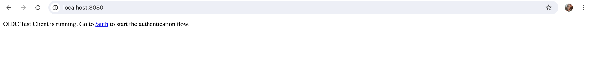
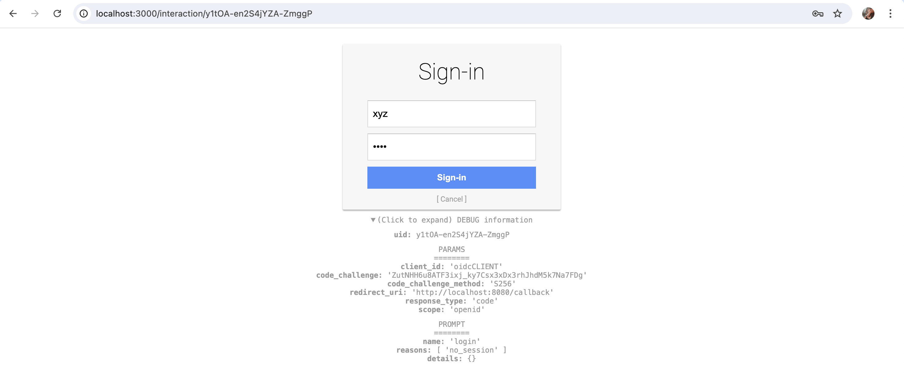

# OIDC Provider and Client

This project sets up an OpenID Connect (OIDC) provider and a relying party (RP) client using Node.js. The provider and client are in separate folders for better organization.


## Installation

1. Clone the repository and navigate to the project:

    ```sh
    git clone https://github.com/MSumukhi/oidc-provider-package.git
    cd oidc-provider-package
    ```

2. Install dependencies for both provider and client:

    ```sh
    cd ../Provider
    npm install
    cd ../client
    npm install
    ```

## Running the Provider

1. Start the OIDC provider server:

    ```sh
    cd Provider
    node server.js
    ```

2. Verify the provider at `http://localhost:3000/.well-known/openid-configuration`.

## Running the Client

1. Start the RP client:

    ```sh
    cd client
    npx nodemon client.js
    ```

2. Access `http://localhost:8080/auth` to start the authentication flow.

## Features

- **OIDC Provider**: Basic setup with token introspection and revocation.
- **OIDC Client**: Handles the authentication flow and token management using `openid-client`.

## Screenshots

### Provider Configuration


### Client Authentication Flow



### Session and Token Details


